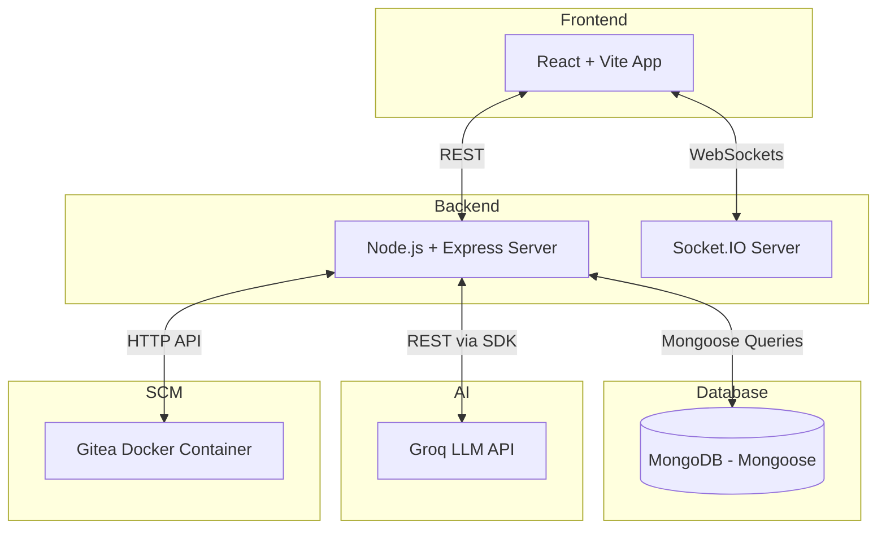
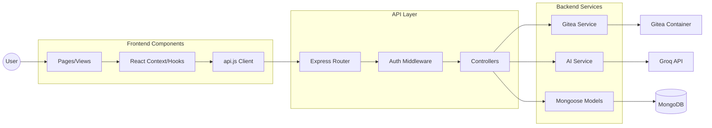
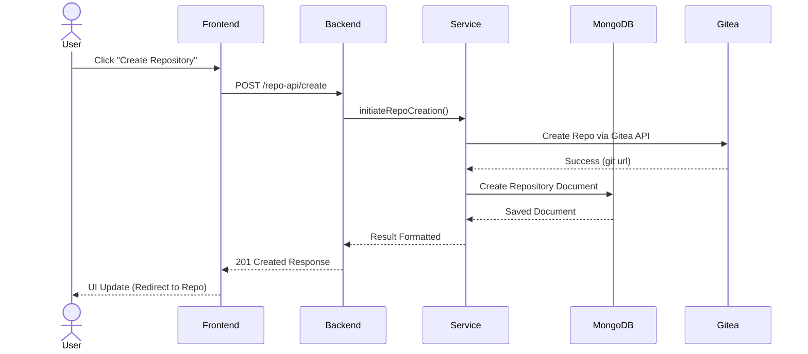
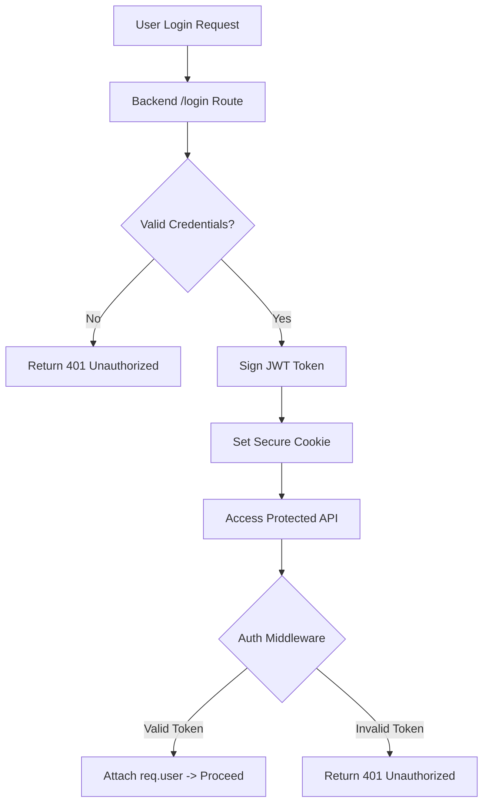
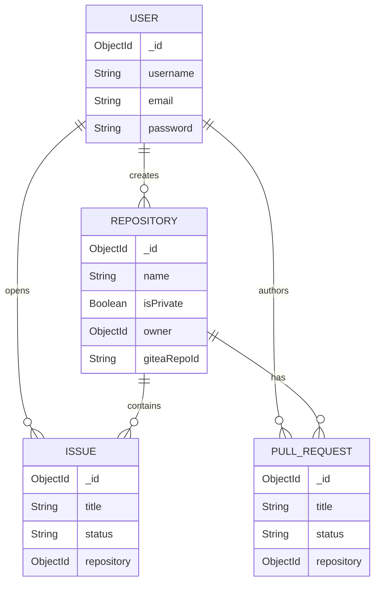
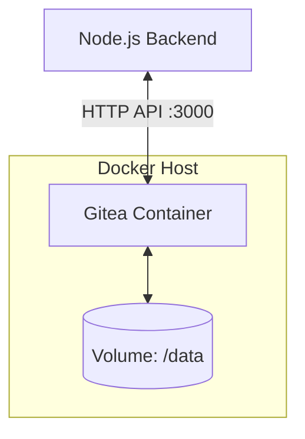

# Project Architecture & System Documentation 🏗️

## 1. Project Overview

**Purpose of the application:**
This application is a comprehensive **GitHub Clone** designed to provide robust repository management, collaboration features, issue tracking, and advanced AI-powered assistance.

**Core features:**
- Repository management (create, clone, fork, branch)
- Pull requests and code reviews
- Issue tracking and discussions
- Organizations and Team management
- Real-time notifications and webhooks
- AI-powered coding companion (Code explanation, PR review)

**System architecture style:**
Decoupled Client-Server architecture utilizing a RESTful API, WebSockets for real-time events, and a hybrid storage system (MongoDB for metadata + Self-hosted Gitea for Git engine).

**Technology stack:**
- **Frontend**: React, Vite, Tailwind CSS, Framer Motion
- **Backend**: Node.js, Express.js, Socket.IO
- **Database**: MongoDB (Mongoose)
- **Git Engine**: Gitea (Dockerized)
- **AI Integration**: Groq API

---

## 2. Directory Structure Analysis

```text
project-root/
├── backend/
│   ├── apis/              # Express route handlers and controller logic for each domain
│   ├── middleware/        # Express middlewares (Authentication, File Uploads, Error handling)
│   ├── models/            # Mongoose schemas (e.g., UserModel, RepositoryModel, PullRequestModel)
│   ├── services/          # Core business logic interfacing with Gitea API and Groq
│   ├── uploads/           # Temporary local storage for incoming files
│   ├── utils/             # Utility helpers
│   ├── server.js          # Entry point for the Express API server
│   └── socket.js          # WebSocket setup for real-time communication
├── frontend/
│   ├── public/            # Static assets
│   ├── src/
│   │   ├── assets/        # Images, CSS (index.css)
│   │   ├── components/    # Reusable UI components (Modals, Cards, Buttons)
│   │   ├── constants/     # Global constants and config
│   │   ├── pages/         # React Router page views
│   │   ├── theme/         # Theming contexts
│   │   ├── App.jsx        # Root component and Routing setup
│   │   ├── api.js         # Axios instance for backend communication
│   │   └── main.jsx       # React DOM rendering entry
│   └── vite.config.js     # Vite configuration
└── docker-compose.yml     # Docker infrastructure config (Gitea + DB)
```

**Directory Details:**
- `backend/apis/`: Contains domain-specific endpoints (`repoAPI`, `userAPI`, `prAPI`) reducing monolithic routing.
- `backend/services/`: Decouples external API communication (Gitea, Groq) from controllers.
- `frontend/src/components/`: Modular, Tailwind-styled components enabling high reusability across the UI.
- `frontend/src/pages/`: Dedicated views for distinct routes, lazy-loaded to improve Vite application performance.

---

## 3. API Flow Documentation

### Typical Request Flow
```text
Frontend Component
    ↓ (Axios HTTP Request)
API Service (frontend/src/api.js)
    ↓ (Network boundary)
Backend Route (backend/apis/*.js)
    ↓ (Express Middleware: Auth Validation)
Controller Logic
    ↓ (Function Call)
Service Layer (backend/services/*.js)
    ↓ (DB Query / External API)
Database / External Service (MongoDB / Gitea)
    ↓
Response
```

### Key API Endpoints Discovered

| HTTP Method | Route Path | Request Body | Response Format | Authentication Requirements |
|---|---|---|---|---|
| **POST** | `/user-api/register` | `{ username, email, password }` | JSON (User data + Token) | Public |
| **POST** | `/user-api/login` | `{ email, password }` | JSON (User data + Token) | Public |
| **GET** | `/repo-api/:id` | None | JSON (Repository details) | Protected |
| **POST** | `/repo-api/create` | `{ name, description, isPrivate }` | JSON (Created repo) | Protected |
| **POST** | `/pr-api/create` | `{ title, base, head, repoId }` | JSON (PR metadata) | Protected |
| **POST** | `/issue-api/create`| `{ title, body, repoId }` | JSON (Issue details) | Protected |
| **POST** | `/webhook-api/gitea`| Gitea Webhook Payload | JSON (Status) | Webhook Secret |

---

## 4. Service Dependency Map

### Internal Services
- **Auth Service**: Manages JWT signing, verification, and password hashing.
- **Webhook Service**: Processes incoming Gitea events to sync MongoDB.
- **WebSocket Service**: Pushes real-time updates to connected clients.

### External Services
- **Groq API**: Provides LLM capabilities for the AI Companion (Code analysis, PR summaries).
- **Gitea API**: Acts as the underlying Git engine. All git-level operations (commits, diffs) are delegated here.

### Database Dependencies
- **MongoDB Atlas**: Primary store for users, repository metadata, issues, pull requests, and discussions.
- **SQLite (Inside Gitea Docker)**: Private database for the Gitea container to manage its internal state.

---

## 5. Mermaid Architecture Diagrams

### System Architecture Diagram



---

## 6. Component Interaction Diagram



---

## 7. Request Lifecycle Diagram



---

## 8. Authentication Architecture

**Flow Elements:**
- **Login Flow**: Validates credentials against MongoDB -> generates JWT -> sets in HTTP-only cookie or returns in JSON payload.
- **Protected Routes**: Express middleware validates the JWT from cookies/headers on restricted endpoints.
- **Session Management**: Handled statelessly via JWT expiration.



---

## 9. Database Architecture

**Core Collections:** Users, Repositories, PullRequests, Issues, Organizations.
**Relationships:** 
- User -> Repositories (One-to-Many)
- Repository -> Issues/PullRequests (One-to-Many)



---

## 10. Docker Architecture

The project relies on Docker primarily for the backend infrastructure dependencies (Gitea).

**Architecture Elements:**
- **Containers**: `gitea/gitea:latest` for repository hosting.
- **Networks**: Internal docker bridge network for Gitea <-> Gitea DB communication.
- **Volumes**: `gitea_data` persistent volume for repositories.



---

## 11. External Integrations

### Groq API
- **Purpose**: AI coding companion.
- **Entry Points**: `backend/apis/chatAPI.js`.
- **Request Flow**: Receives prompt from frontend + context (code snippets) -> Calls Groq SDK with `llama3` model.
- **Response Flow**: Streams or returns markdown-formatted analysis back to the UI.

### Gitea
- **Repository Creation**: Mirrors repository creation in MongoDB by making a real git repo on Gitea.
- **Commit Flow**: Frontend requests file tree/commits -> Backend proxy calls Gitea API.
- **Webhook Flow**: Gitea pushes events (e.g., `push`, `pull_request`) -> Backend `/webhook-api` -> Syncs MongoDB.

---

## 12. Data Flow Analysis

### User Authentication
1. User submits credentials.
2. Backend verifies hash, issues JWT.
3. Frontend stores user context globally.

### Course Creation
*Note: As this application is a GitHub Clone, "Course Creation" is not a native domain workflow. The equivalent core entity is "Repository Creation".*
1. User submits repository details.
2. Backend validates request.
3. Backend calls Gitea API to initialize git repository.
4. Backend creates Repository document in MongoDB linked to User.
5. Returns success to frontend.

### AI Agent Execution
1. User highlights code and requests review in GitHubCompanion UI.
2. Frontend sends payload (Code + Prompt) to Backend.
3. Backend passes data to Groq API.
4. Groq processes prompt using LLM.
5. AI insights are returned to frontend for rendering.

### Repository Management
1. User views repo. Backend fetches metadata from Mongo.
2. Backend fetches Git Tree from Gitea API.
3. Both sets of data are merged and returned to the UI.

### File Upload
1. User uploads Avatar/Asset.
2. Express `multer` middleware handles multipart/form-data.
3. File saved temporarily in `backend/uploads/` or sent to Cloudinary.
4. Public URL saved to MongoDB entity.

### Assessment Flow
*Note: As a Developer Platform, this maps to "Pull Request Review Flow".*
1. User opens PR.
2. Reviewers add comments via UI.
3. Backend saves comments in `ReviewCommentModel`.
4. User addresses comments, updates PR status.
5. PR is merged via Gitea API trigger.

---

## 13. Architecture Strengths

- **Scalability**: By delegating heavy git processing to a dedicated Gitea instance, the Node.js backend remains lightweight and capable of handling high concurrency.
- **Modularity**: Frontend components are strictly isolated; backend routes are segregated by entity domain.
- **Performance**: MongoDB is utilized for rapid queries of application metadata (discussions, stars) instead of parsing raw git objects for every request.
- **Security**: JWT-based stateless authentication combined with environment variable segregation for secrets.

---

## 14. Improvement Suggestions

- **Refactoring Opportunities**: Extract database queries from Controllers into the Service layer to fully implement the Repository pattern.
- **Security Enhancements**: Implement rate limiting on API endpoints to prevent brute-forcing. Hardcode CORS origins instead of wildcards for production.
- **Performance Improvements**: Introduce a Redis caching layer for frequently accessed repositories or heavy AI responses to minimize latency and API costs.
- **Architectural Improvements**: Containerize the Frontend and Backend applications alongside Gitea to ensure environment parity across all developer machines and simplify deployment.
