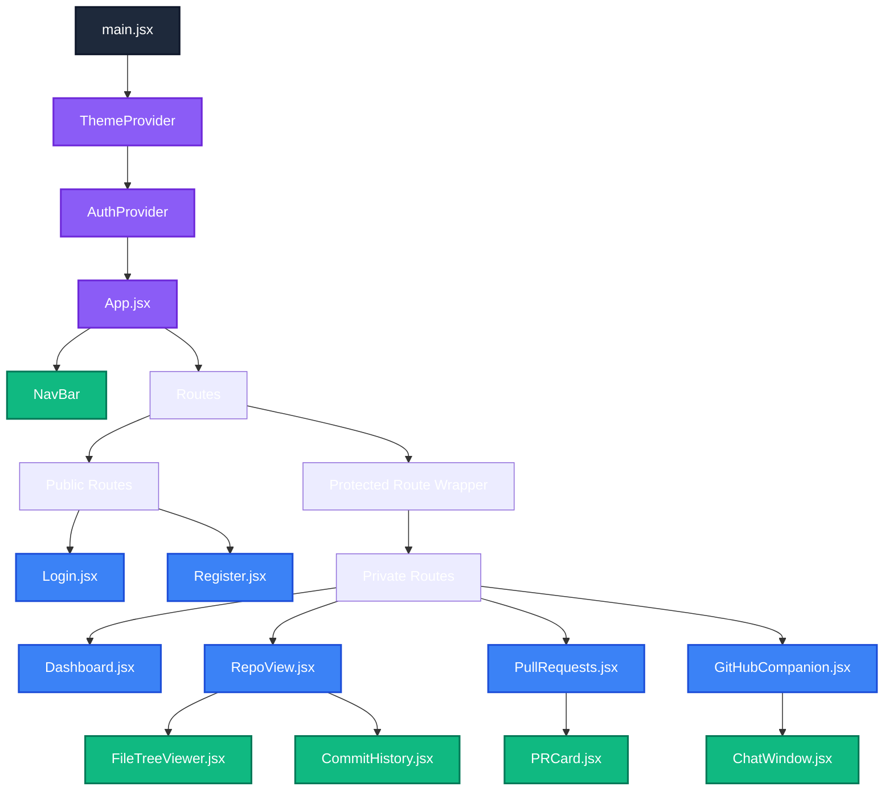

# Service Components & Frontend Architecture 🧩

This document maps the relationships between backend services and dives deep into the frontend React structure.

## 1. Service Interaction Matrix

The backend relies heavily on distinct service modules to abstract business logic away from Express controllers.

| Component / Service | Primary Role | Depends On (Internal) | External Dependency |
|----------------------|--------------|-----------------------|---------------------|
| `giteaAuthService` | Syncs Users to Gitea | `UserModel` | Gitea API (`/user`) |
| `giteaRepoService` | Repo Lifecycle | `RepositoryModel` | Gitea API (`/repos`) |
| `giteaCommitService` | Reads Git History | `RepoModel`, `BranchModel` | Gitea API (Git Trees) |
| `giteaPRService` | PR Merging & Diffs | `PullRequestModel` | Gitea API (Pulls) |
| `giteaOrgService` | Org/Team sync | `OrganizationModel` | Gitea API (`/orgs`) |
| `giteaWebhookService`| Listens to Gitea Pushes| Event Handlers | Webhook Payloads |
| `activityFeedService`| Aggregates events | `ActivityLogModel` | MongoDB |
| `socketNotificationService`| Real-time alerts | None | Socket.IO Clients |
| `repoSyncService` | Fallback sync scripts | All Gitea Services | Cron/Manual Triggers |
| `chatService` / `AIService`| LLM Integrations | None | Groq SDK |

---

## 2. Frontend Architecture Deep Dive

The frontend is a Single Page Application (SPA) built with Vite and React.

### 2.1 Core Foundation Elements
- **`main.jsx`**: The root render point. Wraps the application in global providers (Theme, Auth, Router).
- **`App.jsx`**: Defines the central routing layout. Employs `React.Suspense` for lazy-loading views to keep the initial Vite bundle small.
- **Routing Structure**: Uses `react-router-dom`. Routes are split into `Public` (Login/Register) and `Protected` (Dashboards, Repo Views).
- **Protected Routes**: A custom `<ProtectedRoute>` component intercepts rendering. If the `AuthContext` lacks a valid user, it redirects to `/login`.

### 2.2 Component Hierarchy Diagram

### 2.3 State Management Flow
- **Global State**: Handled primarily via React Context (`AuthContext` for user session, `ThemeContext` for dark/light mode).
- **Server State**: Handled via custom hooks fetching from the Axios instance (`api.js`). 
- **Component State**: Uses standard `useState` and `useReducer` for form handling and localized UI toggles (modals, dropdowns).
