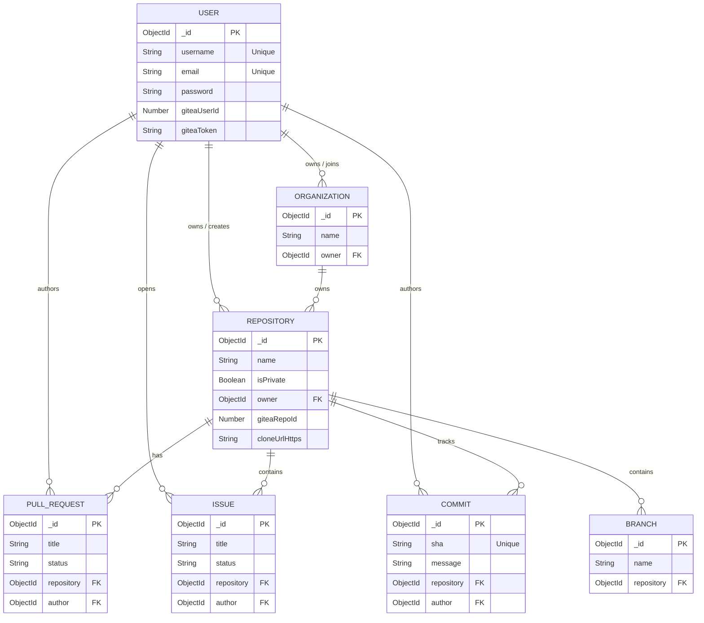

# Database Design & Architecture 🗄️

This document outlines the comprehensive MongoDB schema design, collections, and relationships that form the backbone of the application's metadata storage.

## 1. Entity Relationship Diagram (ERD)

## 2. Collection Definitions

### `users` Collection (`UserModel.js`)
- **Fields**: `username`, `email`, `password` (hashed), `avatarUrl`, `socialLinks`, `notificationPrefs`, `giteaUserId`, `giteaToken`.
- **References**: `followers` (User), `following` (User).
- **Indexes**: Unique index on `username` and `email`.

### `repositories` Collection (`RepositoryModel.js`)
- **Fields**: `name`, `description`, `language`, `isPrivate`, `visibility`, `defaultBranch`, `giteaRepoId`, `cloneUrlHttps`, `cloneUrlSsh`.
- **References**: `owner` (User), `organization` (Organization), `collaborators` (User), `parentRepoId` (Repository - for forks).
- **Relationships**: Core entity linking Users to Git Operations.

### `pullrequests` Collection (`PullRequestModel.js`)
- **Fields**: `title`, `description`, `status` (OPEN, CLOSED, MERGED), `baseBranch`, `headBranch`.
- **References**: `repository` (Repository), `author` (User), `reviewers` (User).

### `issues` Collection (`IssueModel.js`)
- **Fields**: `title`, `body`, `status` (OPEN, CLOSED), `labels`.
- **References**: `repository` (Repository), `author` (User), `assignees` (User).

### `organizations` Collection (`OrganizationModel.js`)
- **Fields**: `name`, `description`, `avatarUrl`.
- **References**: `owner` (User), `members` (User).

## 3. Data Synchronization Strategy

While MongoDB stores the **metadata** (titles, descriptions, comments, stars, organizations), the actual Git data (blobs, trees, commits, diffs) resides in the **Gitea Container Database**. 

- **Cross-Referencing**: Every MongoDB `Repository` document holds a `giteaRepoId`.
- **Webhooks**: Gitea Webhooks trigger the Express backend (`webhookAPI.js`) to sync status changes (e.g., when a PR is merged via CLI, Gitea notifies Node.js to update the MongoDB `PullRequest` status to `MERGED`).
