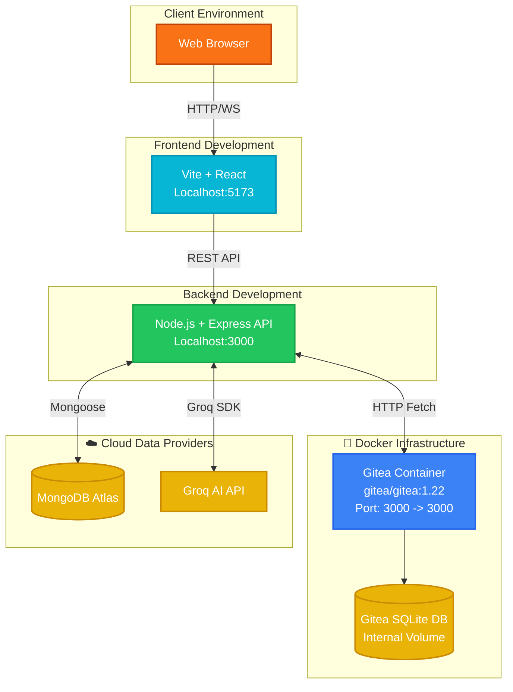

# Infrastructure & Security Architecture 🔐

This document maps the Docker container infrastructure and details the comprehensive security analysis of the MERN application.

## 1. Docker Infrastructure Architecture

The project relies on Docker to host the internal Git engine (Gitea) separate from the Node.js API.

## 2. Security Analysis

### 2.1 JWT Authentication & Middleware Chain
- **JWT**: JSON Web Tokens are used for stateless authentication. Upon login, a token is signed with a secret (`JWT_SECRET`).
- **Storage**: Tokens are generally stored in HTTP-Only cookies or securely in memory to mitigate XSS attacks.
- **Middleware Chain**:
  1. `verifyToken.js`: Checks the `Authorization` header or cookies. Decodes the token and attaches `req.user`.
  2. `repoAuth.js`: Specific Role-Based Access Control (RBAC) middleware verifying if the authenticated user has permission (Read/Write/Admin) over the requested repository.
  3. `orgAuth.js`: Verifies Organization owner/member privileges.

### 2.2 Password Hashing
- **Bcrypt**: User passwords are encrypted using `bcrypt.js` with a robust salt round before being stored in MongoDB.
- **Gitea Sync**: Gitea account creation uses secure randomly generated passwords; users interface directly with the Node.js application, not Gitea's frontend.

### 2.3 API Secrets & Environment Variables
Critical secrets are managed via `.env` and are strictly excluded from source control (`.gitignore`).
- `MONGO_URI`: Atlas connection string.
- `JWT_SECRET`: App authentication secret.
- `GITEA_ADMIN_TOKEN`: High-privileged token for the backend to orchestrate the Gitea container.
- `GITEA_TOKEN_ENCRYPTION_KEY`: AES-256-GCM key used to encrypt individual users' Gitea Personal Access Tokens (PATs) at rest in MongoDB.
- `GROQ_API_KEY`: Secrets for AI integrations.

### 2.4 Protected Routes
Routes are strictly protected by decorators/middlewares.
- **Public**: `/login`, `/register`, viewing Public Repositories.
- **Protected**: `/repo-api/create`, `/pr-api/*`, Private Repository Access.

### 2.5 Role Based Access Control (RBAC)
Repository permissions are strictly defined:
- **Owner**: Full destructive capabilities (Delete repo, add collaborators).
- **Collaborator**: Write access (Push commits, merge PRs).
- **Viewer**: Read access (Clone, view issues).
This is enforced both in the Node API via `repoAuth.js` and physically enforced by Gitea's internal git hooks.
