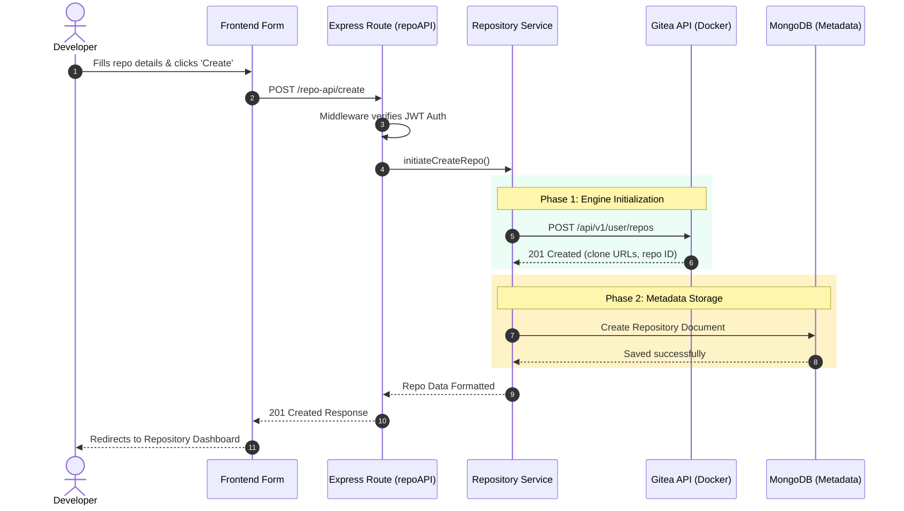
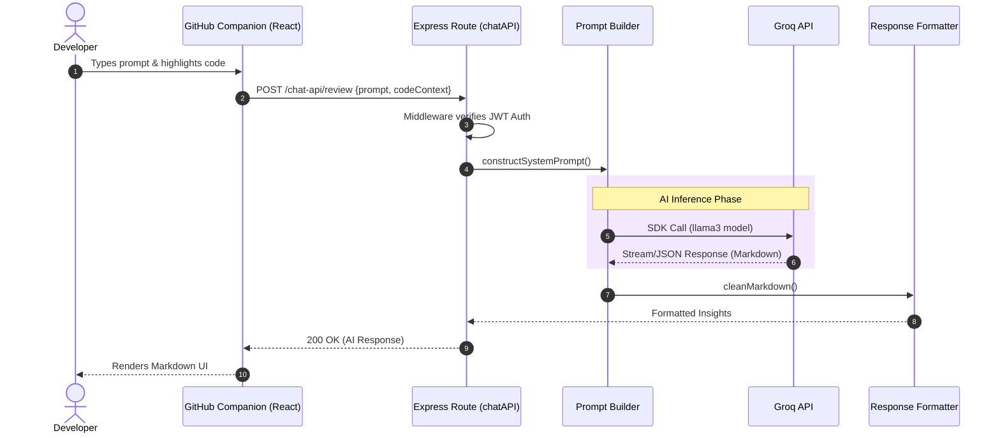

# Sequence Diagrams & Execution Flow ⏱️

This document details the step-by-step execution flows of the most critical complex operations within the application.

## 1. Repository Creation Flow

This sequence demonstrates the hybrid architecture approach, synchronizing state between MongoDB (Metadata) and Gitea (Git Engine).

## 2. AI Agent Architecture Flow

This sequence traces the lifecycle of a Groq AI LLM call, from the user's prompt to the formatted response.

